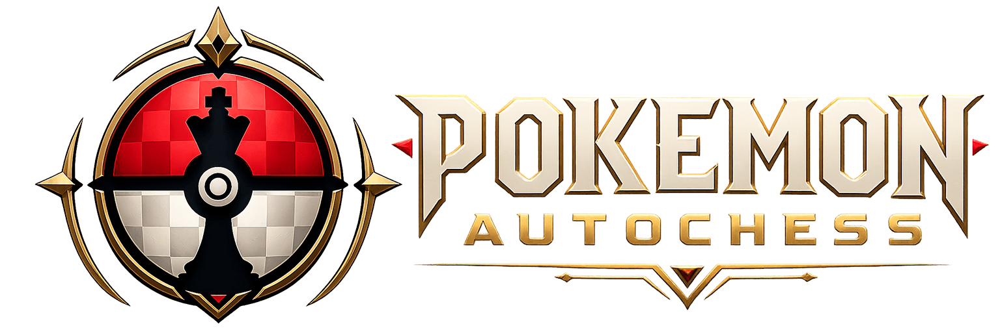
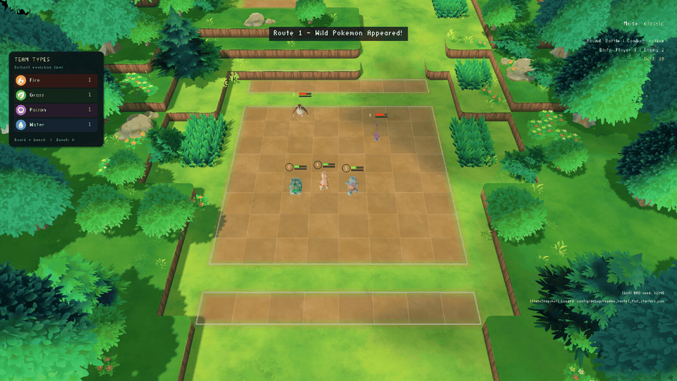
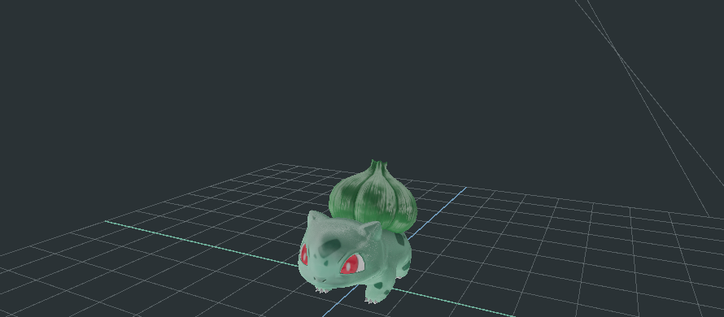
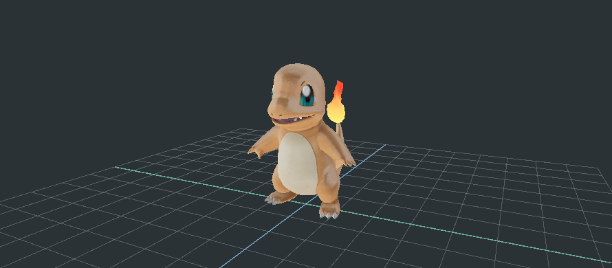
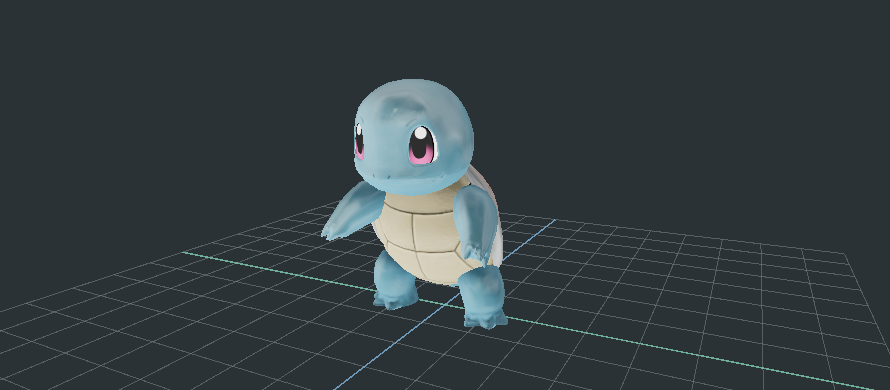

<p align="center">
  <a href="https://phlosion.com/?demo=autochess#demos">
    
  </a>
</p>

<h1 align="center">3D Pokémon Auto-Battler</h1>

<p align="center">
  A C++20 strategy game prototype built on Phlosion Engine.<br>
  Stage a team, resolve scripted battles, and inspect the same game inside the editor.
</p>

<p align="center">
  <a href="https://isocpp.org/"></a>
  <a href="https://www.lua.org/manual/5.4/"></a>
  <a href="https://wiki.libsdl.org/SDL2/FrontPage"></a>
  <a href="https://cmake.org/"></a>
  <a href="https://vcpkg.io/"></a>
  <br>
  <a href="https://www.opengl.org/"></a>
  <a href="https://www.vulkan.org/"></a>
  <a href="https://learn.microsoft.com/en-us/windows/win32/direct3d12/direct3d-12-graphics"></a>
</p>

<p align="center">
  <a href="https://github.com/AdamWentworth/PokemonAutochess/actions/workflows/ci.yml"></a>
  
  <a href="docs/LICENSING.md"></a>
</p>

<p align="center">
  <a href="https://phlosion.com/?demo=autochess#demos">Phlosion Showcase</a> &middot;
  <a href="https://github.com/AdamWentworth/PhlosionEngine">Engine</a> &middot;
  <a href="docs/DEVELOPMENT.md">Development Guide</a> &middot;
  <a href="docs/README.md">Documentation</a>
</p>

Pokemon Autochess is a game and runtime-systems portfolio project by
[Adam Wentworth](https://github.com/AdamWentworth), presented through
[Phlosion](https://phlosion.com/). It brings together team placement, Lua-driven
combat, shops and rounds, animated 3D characters, authored environments, and
repeatable rendering checks.

**This repository owns the game.** The reusable engine and VFX primitives have
separate repositories and verification boundaries.

> [!NOTE]
> This is an educational game prototype. Balancing, content and the player
> experience are still evolving. It is not affiliated with Nintendo, Game Freak
> or The Pokémon Company. Runtime assets are restored from a private depot;
> cloning the source alone does not provide a playable content bundle.

## Product Preview

[](docs/assets/readme/route1-flat-starters.png)

*Bulbasaur, Charmander and Squirtle battle Pidgey and Rattata on the Blender-authored Route 1 Flat Dirt Experiment, the current editor startup map. Eight seconds captured in the native Direct3D 12 game, with character inking and performance diagnostics off. Click the preview for a full-resolution still.*

| Bulbasaur | Charmander | Squirtle |
| --- | --- | --- |
| [](docs/assets/readme/bulbasaur-material.png) | [](docs/assets/readme/charmander-material.png) | [](docs/assets/readme/squirtle-material.png) |

These are fresh game and editor captures using the promoted starter models.
The [Phlosion showcase](https://phlosion.com/?demo=autochess#demos)
also includes earlier prototype footage. See [media provenance and regeneration](docs/DEMO_MEDIA_CAPTURE.md#readme-branding-and-showcase).

## Highlights

- **Scripted auto-battler loop:** placement, movement, combat, rounds, shops,
  benches and cards, with Lua tuning and C++ runtime services.
- **Three native graphics APIs:** OpenGL, Vulkan and Direct3D 12 share gameplay
  presentation requirements and visual/content qualification.
- **Animated characters and effects:** cooked models, skeletal animation,
  character materials and layered fire are used by both game and editor previews.
- **Authored environments:** Blender workflows publish arenas into the cooked
  Route 1 scene pipeline.
- **An embedded game preview:** the game-owned editor plugin supplies scene
  catalogs, inspectors, preview scenarios and gameplay reload inside Phlosion Editor.
- **Repeatable development:** deterministic snapshots, CPU contracts, data
  validation, VFX preview tools, screenshot matrices and release tooling.

## Architecture and Ownership

| Repository | Responsibility |
| --- | --- |
| **PokemonAutochess** | Gameplay, board and combat UI, scene/content policy, editor project plugin, character and field materials |
| [PhlosionEngine](https://github.com/AdamWentworth/PhlosionEngine) | Application/platform services, generic rendering and UI, resources, animation, standard PBR, editor host |
| [PhlosionVFX](https://github.com/AdamWentworth/PhlosionVFX) | Reusable effect primitives, runtime bridges and preview support |

`GameRuntime` and `GameSession` wire game states, systems, scripting and
presentation. The runner and editor plugin share this game runtime. Engine
backends consume the game's material profile through a generic, versioned
interface; recovered Pokémon shader behavior stays in this repository.

See [project boundaries](docs/PROJECT_BOUNDARIES.md),
[character materials](docs/CHARACTER_MATERIALS.md), and
[field materials](docs/FIELD_MATERIALS.md).

## Technology Stack

| Layer | Technology | Role |
| --- | --- | --- |
| Game runtime | C++20, Phlosion Engine | Sessions, state transitions, simulation and presentation |
| Gameplay scripting | Lua 5.4, sol2 | Combat, shop logic, state flow and tuning |
| Platform and UI | SDL2, SDL2_ttf, Dear ImGui | Window/input, text and editor interfaces |
| Graphics | OpenGL, Vulkan, Direct3D 12, GLSL, HLSL, GLM | Native backends, materials, animation and graphics math |
| Assets and data | PHRC containers, JSON, nlohmann-json, fastgltf, KTX, stb | Cooked resources, configuration and supported import paths |
| Authoring | Blender, game-owned exporters | Authored arenas and environment publication |
| Build and verification | CMake, vcpkg, CTest, GitHub Actions, PowerShell, Python | Dependencies, builds, contracts, validation and capture tooling |

Versions and dependencies are defined by [CMake](CMakeLists.txt),
[the presets](CMakePresets.json), and [the vcpkg manifest](vcpkg.json).

## Quick Start (Windows)

Use Visual Studio 2026 Build Tools, CMake 4.2 or newer, and vcpkg with
`VCPKG_ROOT` configured. Visual Studio 2022 and MSVC/Ninja alternatives are
in the [development guide](docs/DEVELOPMENT.md#getting-started-windows).

Build the standalone game target:

```powershell
git clone https://github.com/AdamWentworth/PokemonAutochess.git
cd PokemonAutochess
cmake --preset vs2026 -DPAC_BUILD_EDITOR=OFF
cmake --build --preset release --target PokemonAutochess
```

CMake uses available local Phlosion checkouts or fetches the exact pinned commits.
The build generates the project's material programs automatically.

Running the game requires the private runtime assets and cooked content. With
those restored, launch:

```powershell
.\build\Release\PokemonAutochess.exe
```

For engine development and editor use, follow the
[paired editor/plugin build instructions](docs/DEVELOPMENT.md#phlosion-editor).
[Asset setup](docs/EXTERNAL_ASSET_RESEARCH.md) and the
[Blender workflow](docs/BLENDER_ARENA_PILOT.md) explain the content boundaries.

## Verification

```powershell
cmake --build build --config Debug --target PAC_Tests
ctest --test-dir build -C Debug --output-on-failure
.\tools\check_docs_hygiene.ps1
```

The [test plan](docs/TEST_PLAN.md) separates CPU contracts, private-asset checks,
editor pairing and native GPU qualification. Hosted CI is asset-independent and
runs the explicit source suite; restore the private corpus and run
`.\tools\qualify_content.ps1` for the content scope. See the
[CI runbook](docs/CI.md) for the job split and the current infrastructure gaps.
Hosted CI does not replace the three-API visual checks on the local GPU
workstation.

The September 19 material-boundary refactor preserved **45 editor captures and
30 native model regions pixel-for-pixel** against their same-renderer baselines.
The verification record also covers Vulkan direct submission, standalone engine
defaults and benchmark limitations. See [the recorded results](docs/CHARACTER_MATERIALS.md#boundary-verification-2026-09-19).

## Repository Map

```text
src/game/         Game runtime, UI, editor plugin and material programs
scripts/          Lua gameplay logic and configuration hooks
config/           Game data, project profiles and verification matrices
tests/            Game contracts, invariants and material checks
tools/            Authoring, cooking, builds, diagnostics and capture tools
docs/             Architecture, runbooks and selected showcase media
assets/           Private runtime payloads; restored separately
content/phlosion/ Private cooked content; restored separately
.phlosion/        Generated editor plugins and material programs
```

## Documentation

- [Development guide](docs/DEVELOPMENT.md): build targets, editor setup, snapshots,
  VFX tools, debugging and packaging.
- [Project boundaries](docs/PROJECT_BOUNDARIES.md): game, engine, package and
  research ownership.
- [Editor scene model](docs/EDITOR_SCENE_MODEL.md): authored scenes and game preview.
- [Renderer configuration](docs/RENDERER_CONFIGURATION.md) and
  [parity contract](docs/RENDERER_PARITY_CONTRACT.md): supported APIs and verification rules.
- [Character materials](docs/CHARACTER_MATERIALS.md) and
  [field materials](docs/FIELD_MATERIALS.md): project-owned programs and provenance.
- [Documentation index](docs/README.md): the full set of active engineering references.

## Licence

Original game code, tools and text documentation are licensed under the
[Apache License 2.0](LICENSE).
Pokemon artwork, models, animations, audio, trademarks, recovered material
implementations and other third-party content are excluded. Dependencies keep
their own licences. See [licensing scope and excluded paths](docs/LICENSING.md)
before reusing or distributing material from this repository.
